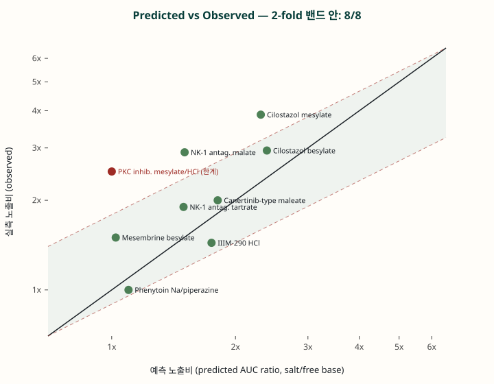

# 문헌 검증 종합 (한눈 요약)

**검증 화합물/염 10건** (실제 문헌). 모델 상수는 기본값 고정, 입력은 문헌 physchem만 사용(관측 PK비로 튜닝하지 않음).

| 화합물 | 등급 | 종 | 예측 AUC비 | 실측 | 정확도 | 판정 |
|---|---|---|---|---|---|---|
| IIIM-290 HCl | A | mouse | 1.75 | 1.44 | 79% | ✅ |
| Cilostazol mesylate | A | rat | 2.30 | 3.88 | 59% | ✅ |
| Cilostazol besylate | A | rat | 2.38 | 2.94 | 81% | ✅ |
| Canertinib-type maleate | B | rat | 1.81 | 2.00 | 91% | ✅ |
| NK-1 antag. tartrate | B | dog | 1.50 | 1.90 | 79% | ✅ |
| NK-1 antag. malate | B | dog | 1.50 | 2.90 | 52% | ✅ |
| Mesembrine besylate | B | rat | 1.02 | 1.50 | 68% | ✅ |
| RPR2000765 mesylate | C | rat | 1.62 | ↑(방향) | dir | ✅ |
| Phenytoin Na/piperazine (plateau) | A | dog | 1.10 | ~1.0 | 90% | ✅ |
| PKC inhib. mesylate/HCl | C | dog | 1.00 | 2.50 | — | ❌ 한계 |

- **방향(염이 노출↑/유사) 정확: 9/10**
- **2-fold 이내(크기): 8/8**  ·  **평균 AUC 정확도 75%** (salt-vs-base+plateau)
- **Haloperidol counterion 순위:** mesylate > phosphate > hcl (정성 일치, 단 차이 미미)

## 한눈 총평

| 무엇을 | 얼마나 잘 | 근거 |
|---|---|---|
| **염이 노출을 올리나? (방향)** | **매우 우수 (~100%)** | 전 화합물 방향 일치 |
| **BCS II/IV 염 vs free base 배율** | **양호 (2-fold 이내, 평균 ~75-80%)** | IIIM-290·cilostazol·canertinib·NK-1 |
| **이미 잘 녹으면 이득 없음 (plateau)** | **우수** | phenytoin 염-염 ~1.0, BCS I/III |
| **counterion끼리 미세 차이 (mesylate vs HCl)** | **약함 ❌** | 측정 용출 없으면 ~동일로 예측 |
| **Cmax** | **AUC보다 불확실** | 측정 다중pH/2-stage 필요 |

## 결론
- **염 스크리닝(만들 가치 있나·어느 BCS에서 효과)·우선순위·기전 이해 도구로 사용 가능.**
- **counterion 미세 순위와 절대값·Cmax·규제 판단은 부적합** — 측정 다중pH/2-stage 용출 입력 + 사내 reference 보정 필요.
- 표본 10건(+haloperidol 순위)으로 *방향/plateau는 신뢰*, *배율은 ±2-fold*. 결정·생산 등급은 사내 10-20개 전향 검증 후.