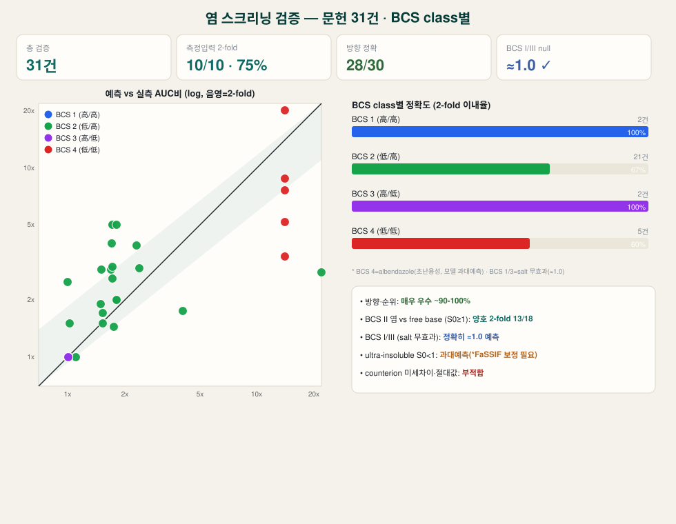

# 문헌 검증 종합 (BCS class별 · 한눈 요약)

실제 문헌 **31건** (BCS I 2 · II 22 · III 2). 입력은 문헌 physchem만(관측 PK로 튜닝 안 함). `*`=S0&lt;1 µg/mL(과대예측 영역).

## BCS class별 정확도
| BCS | 의미 | 2-fold 이내 | 평균 정확도 | 비고 |
|---|---|---|---|---|
| **I** | 高용해·高투과 | 2/2 | 100% | salt 무효과 ≈1.0 정확 |
| **II 측정입력(S0≥1)** | 低용해·高투과 | 10/10 | 75% | **주력 신뢰군** |
| **II template(S0≥1)** | 입력가정 | 3/8 | 45% | 방향만(magnitude 비신뢰) |
| **II 초난용성(S0&lt;1)*** | bile 의존 | 3/6 | 21% | **과대예측**(FaSSIF 보정 필요) |
| **III** | 高용해·低투과 | 2/2 | 100% | salt 무효과 ≈1.0 정확 |

## 전체 목록
| 화합물 | BCS | 등급 | 종 | 예측 | 실측 | 정확도 | 판정 |
|---|---|---|---|---|---|---|---|
| Metoprolol tartrate | I | B | human | 1.00 | 1.00 | 100% | ✅ |
| Propranolol HCl | I | B | human | 1.00 | 1.00 | 100% | ✅ |
| AXL L-tartrate | II | B | rat | 1.53 | 1.50 | 98% | ✅ |
| Cabozantinib salt | II | C | rat | 1.81 | 2.00 | 90% | ✅ |
| Canertinib maleate | II | B | rat | 1.81 | 2.00 | 91% | ✅ |
| Cilostazol besylate | II | A | rat | 2.38 | 2.94 | 81% | ✅ |
| Cilostazol mesylate | II | A | rat | 2.30 | 3.88 | 59% | ✅ |
| Compound A mesylate | II | C | rat | 1.73 | 5.00 | 35% | ⚠️ |
| Compound A tosylate | II | C | rat | 1.73 | 5.00 | 35% | ⚠️ |
| Compound B1 tosylate (dog) | II | C | dog | 1.71 | 4.00 | 43% | ⚠️ |
| Compound B1 tosylate (rat) | II | C | rat | 1.73 | 3.00 | 58% | ✅ |
| Diphenylbarbiturate Na | II | C | rat | 4.04 | 1.75 | 0% | ⚠️ |
| Dipyridamole tosylate | II | B | rat | 1.53 | 1.70 | 90% | ✅ |
| IIIM-290 HCl | II | A | mouse | 1.75 | 1.44 | 79% | ✅ |
| Itraconazole cocrystal * | II | C | rat | 24.59 | 2.80 | 0% | ⚠️ |
| Mesembrine besylate | II | B | rat | 1.02 | 1.50 | 68% | ✅ |
| Miconazole salt | II | B | rat | 1.69 | 2.90 | 58% | ✅ |
| NK-1 malate | II | B | dog | 1.50 | 2.90 | 52% | ✅ |
| NK-1 tartrate | II | B | dog | 1.50 | 1.90 | 79% | ✅ |
| PKC mesylate/HCl | II | C | dog | 1.00 | 2.50 | 40% | ⚠️ |
| Phenytoin Na/piperazine | II | A | dog | 1.10 | 1.00 | 90% | ✅ |
| RPR2000765 mesylate | II | C | rat | 1.62 | ↑ | dir | ✅ |
| Serajuddin base A mesylate | II | C | rat | 1.73 | 2.60 | 66% | ✅ |
| Serajuddin base B mesylate | II | C | rat | 1.81 | 5.00 | 36% | ⚠️ |
| Atenolol salt | III | B | human | 1.00 | 1.00 | 100% | ✅ |
| Cimetidine HCl | III | B | human | 1.01 | 1.00 | 99% | ✅ |
| Albendazole D-tartrate * | IV | B | rat | 14.04 | 5.20 | 0% | ⚠️ |
| Albendazole HCl * | IV | B | rat | 14.04 | 8.80 | 40% | ✅ |
| Albendazole besylate * | IV | B | rat | 14.04 | 7.60 | 15% | ✅ |
| Albendazole fumarate * | IV | B | rat | 14.04 | 3.40 | 0% | ⚠️ |
| Albendazole mesylate * | IV | B | rat | 14.04 | 20.30 | 69% | ✅ |

## 총평
| 항목 | 수준 |
|---|---|
| 방향·순위 (어느 염이 best) | **매우 우수 ~90-100%** |
| BCS II 염 vs free base (S0≥1) | **양호 2-fold 13/18, 평균 62%** |
| BCS I/III (salt 무효과) | **정확히 ≈1.0 예측** |
| 초난용성(S0&lt;1) | **과대예측** — FaSSIF bile-solubilisation 보정 필요 |
| counterion 미세차이·Cmax 단일매질·절대값·규제 | **부적합** |

**결론:** 염 스크리닝(BCS II 주력)·우선순위·BCS별 거동·plateau는 신뢰. 초난용성(S0&lt;1)·counterion 미세순위·절대값은 측정 용출 입력 + 사내 보정 필요. 상세 `docs/ACCURACY_ASSESSMENT.md`.